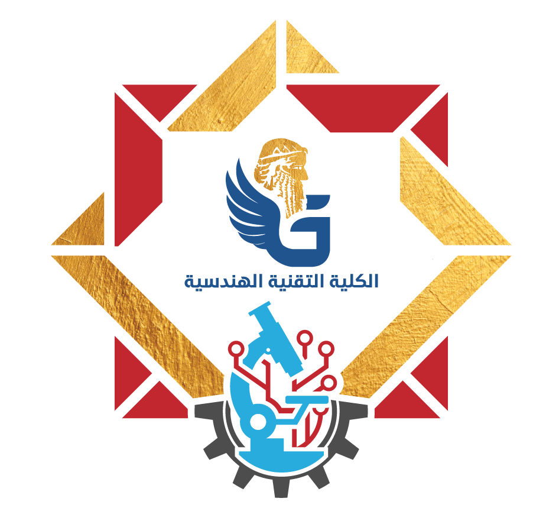

<div align="center">
  
</div>

<h1 align="center">Interactive Microprocessors Basics Engine</h1>

<p align="center">
  <strong>A 3D, Liquid-Glass Presentation Engine featuring Live Hardware Emulation</strong><br/>
  <em>A Microprocessors Seminar developed by First Stage Students for the Logic Gates Material at Gilgamesh University.</em>
</p>

<div align="center">
  
  
  
  
  
</div>

<br />

## 📖 Overview

The **Interactive Microprocessors Basics Engine** is an academic presentation completely re-engineered from the ground up as a fully interactive, single-page web application. It was explicitly created as a **Microprocessors Seminar** for the **Logic Gates Material** at **Gilgamesh University**. 

Instead of traditional PowerPoint static slides, this project leverages an immersive, cyberpunk-inspired visual experience to demonstrate the immense technical capabilities of **First Stage** university students in creating high-tier educational software.

It features **real-time Javascript-based CPU architecture emulators**, interactive logic gates, and procedurally generated background motherboard routing—all rendered live at 60 FPS in the browser. 

---

## ✨ Core Features

* 🔮 **Liquid-Glass Aesthetics:** A 16:9 fully responsive UI utilizing advanced CSS3 `backdrop-filter` glassmorphism, dynamic shadows, and 3D geometric card rotations (`preserve-3d`).
* ⚡ **Live Hardware Emulators:**
  * **Interactive Logic Gates:** Playable AND, OR, NAND, NOR, and XOR gates. Toggle inputs and watch physical LEDs dynamically react in real-time.
  * **Assembly Simulators:** Visual step-by-step debuggers for both generic Assembly and **DEC PDP-11** execution cycles, featuring live Program Counter (PC) and Register (R0) tracing.
  * **Instruction Cycle Animator:** A glowing visualizer for the Fetch-Decode-Execute sequence.
* 🌐 **Procedural Motherboard Tracing:** The background utilizes an HTML5 `<canvas>` to programmatically generate endless, orthogonal high-speed data traces resembling a living CPU die.

---

## 🛠️ Technology Stack

* **Core Engine:** Vanilla JavaScript (ES6+), HTML5, CSS3
* **Graphics:** HTML5 Canvas Context 2D Math & Physics
* **Build Tooling:** Vite (for Lightning-fast HMR and bundling)
* **Assets:** Custom AI-Generated Data Visualization Imagery

---

## 🚀 Installation & Usage

You can instantly deploy this presentation locally on your machine.

### Prerequisites
* Node.js (v16.0 or higher)
* Git

### Local Setup
1. **Clone the repository:**
   ```bash
   git clone https://github.com/YOUR_USERNAME/microprocessors-seminar.git
   cd microprocessors-seminar
   ```

2. **Install the dependencies:**
   ```bash
   npm install
   ```

3. **Start the development server:**
   ```bash
   npm run dev
   ```

4. **View the Presentation:**
   Open your browser and navigate to the provided Vite localhost URL (typically `http://localhost:5173/`). Use the bottom directional controls to navigate through the 30 interactive slides.

---

## 👨‍💻 Development Team

This open-source educational project was directed and developed by:
* **Mustafa Wadhah Fadhil** 
* **Wisam Mohammed Abdul-Mounim** 
* **Abdullah Ahmed Sami Badallah** 

**Academic Affiliation:**  
Gilgamesh University  
*Technical Engineering - Cyber Security*

---

## 📜 License

Created in the pursuit of accessible CPU architecture education. This project is distributed under the [MIT License](LICENSE).
<div align="center">
  <sub>Built with ❤️ by passionate engineers.</sub>
</div>
